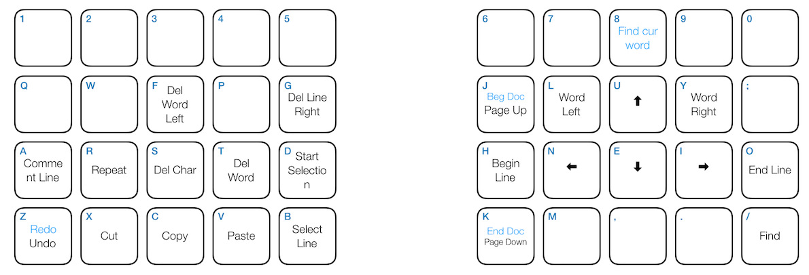

# Neiu Mode README

Neiu Mode is a modal editing mode for Colemak keyboard. There are two modes,
one for executing commands and one for entering texts(like `vi`). You toggle between them with `home` key.

## Features

* Designed for Colemak keyboard.
* Ergonomic key layout.
* Developed on split keyboard(eg. [Kinesys Advantage](https://www.kinesis-ergo.com/shop/advantage2/)) but can be used for normal keyboard.
* Spacemacs like key bindings.

Command mode layout

## Extension Settings

You can change the key for toggling modes:

`{ "key": "home",                  "command": "extension.toggleNeiu",
                                     "when": "editorTextFocus" }`

## Release Notes

### 0.1.0

Initial release.

### 0.2.0

Added commands `space b n`, `space b i` for previous editor, next editor.

## Acknowledgment

This package has been influenced by the following key bindings.

* [Xah Fly Keys](http://ergoemacs.org/misc/ergoemacs_vi_mode.html)
* [Lalopmak Evil](https://github.com/lalopmak/lalopmak-evil)
* [Spacemacs](http://spacemacs.org)